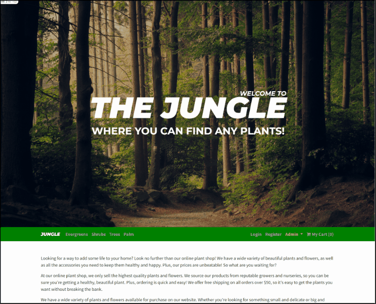
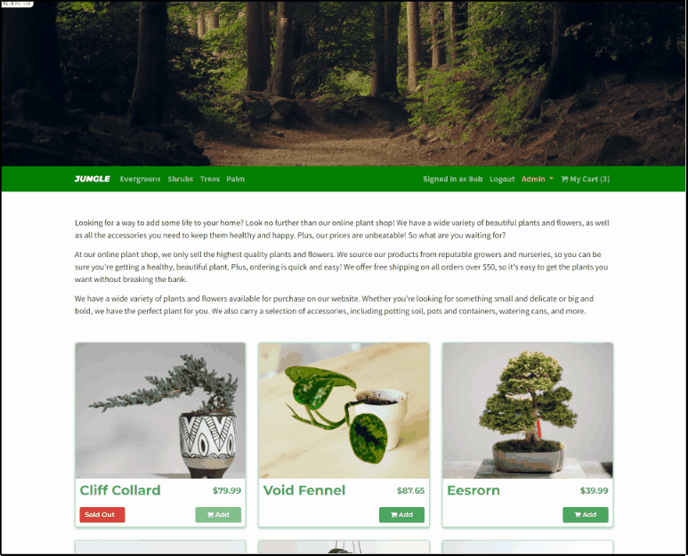
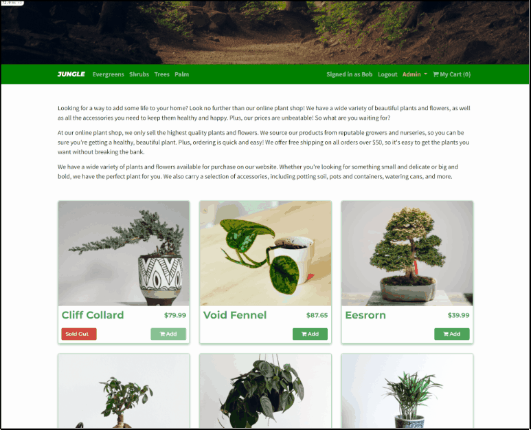

# Jungle

A mini e-commerce application built with Rails 6.1 with User and Admin authentications.

## Features

### 1. Home Page

### 2. User Registration and Log In / Log Out
Including features such as hashed password with bcrypt, validations for existing email, password and confirmed password matching

### 3. Different Categories of Products

### 4. Add-To-Cart and Purchasing
Including features such as disabling sold out products, online payment with Stripe, Order page after completing purchase

### 5. Admin Authentication with HTTP Basic Auth
Please use User: `Jungle`, Password: `book`
Including features such as: dashboard, managing all current products, managing all current categories

### 6. Unit and Integration Testing with Cypress

## Setup

1. Run `bundle install` to install dependencies
2. Create `config/database.yml` by copying `config/database.example.yml`
3. Create `config/secrets.yml` by copying `config/secrets.example.yml`
4. Run `bin/rails db:reset` to create, load and seed db
5. Create .env file based on .env.example
6. Sign up for a Stripe account
7. Put Stripe (test) keys into appropriate .env vars
8. Run `bin/rails s -b 0.0.0.0` to start the server
9. To test with cypress, run `bin/rails cypress:open`

## Database

If Rails is complaining about authentication to the database, uncomment the user and password fields from `config/database.yml` in the development and test sections, and replace if necessary the user and password `development` to an existing database user.

## Stripe Testing

Use Credit Card # 4242 4242 4242 4242; CVC: Any 3 digits; Date: any future date for testing success scenarios.

More information in their docs: <https://stripe.com/docs/testing#cards>

## Dependencies

- Rails 6.1 [Rails Guide](http://guides.rubyonrails.org/v6.1/)
- Bootstrap 5
- PostgreSQL 9.x
- Stripe
